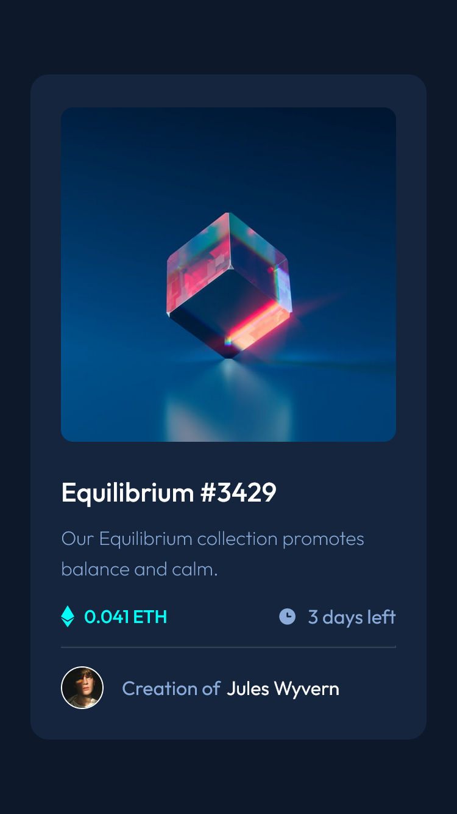

## Welcome! 👋🏼

# Frontend Mentor - NFT Preview Card

[Frontend Mentor](https://www.frontendmentor.io) challenges help you improve your coding skills by building realistic projects


## Table of contents    

- [Overview](#overview)
  - [The challenge](#the-challenge)
  - [Screenshot](#screenshot)
  - [Links](#links)
- [My process](#my-process)
  - [Built with](#built-with)
  - [What I learned](#what-i-learned)
  - [Continued development](#continued-development)
  - [Useful resources](#useful-resources)
- [Author](#author)

## Overview

[This is an entry-level NEWBIE-Free challenge that uses only HTML & CSS](https://www.frontendmentor.io/challenges/nft-preview-card-component-SbdUL_w0U)

## The challenge

- build out this NFT preview card component and get it looking as close to the design as possible.
- See hover states for interactive elements

### Screenshot

- mobile-version 

 
- desktop-version <br/>


### Links

- Solution URL: [Frontend Mentor Solution Page](https://www.frontendmentor.io/solutions/simple-nft-preview-card-component-using-only-html-and-css-gxSaNPGZiA)
- Live Site URL: [GitHub Pages](https://m-lakshan.github.io/FM_Challenge-NFT-Preview-Card-Component-Main/)

## My process

### Built with

- Semantic HTML5 markup
- CSS custom properties
- Flexbox
- Mobile-first workflow
- with Visual Studio Code Editor

### What I learned

I learned an uncommon CSS property while building this project

```css
img {
  mix-blend-mode: *-css-keyword-*;
}
```

what this property does is, give us the accessibility to blend the parent element background with the using element's content.

### Continued development

I never knew this property exists in CSS until one of my Frontend Mentor Community friends pointed that out. Until now whenever some blended effect had to be created in a project, I followed an ordinary element overlaying method. But thanks to this, it is less code & markup.

- special thanks to [Lucas](https://www.frontendmentor.io/profile/correlucas) from Frontend Mentor Community

### Useful resources

- [developer.mozilla.org](https://developer.mozilla.org/en-US/docs/Web/CSS/mix-blend-mode) more about the 'mix-blend-mode' CSS property 

## Author

- Frontend Mentor - [@M-lakshan](https://www.frontendmentor.io/profile/M-lakshan)
- Dev.to - [@mlakshan](https://dev.to/mlakshan)
